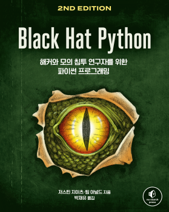

# black-hat-python-2e



이 저장소에는 [(해커와 모의 침투 연구자를 위한 파이썬 프로그래밍) Black Hat Python 2/e](http://www.acornpub.co.kr/book/black-hat-python2e) 한국어판 도서의 예제 소스코드를 포함하고 있습니다.


## 이 책에서 다루는 내용
- 깃허브를 이용한 트로이 목마 지휘 통제 서버 구축
- 키로깅과 스크린샷 캡쳐 자동화 및 샌드박스 여부 탐지
- 웹 해킹 도구인 버프 스위트의 확장 기능 구현
- 창의적인 프로세스 처리 기법으로 윈도우 권한 상승
- 메모리 포렌식 기법을 공격 관점으로 활용해 가상 머신에서 비밀번호 해시를 추출한 후 취약점 정보 획득
- 윈도우의 COM 자동화 기법 악용
- 네트워크로 몰래 데이터 탈취하기

## 소스코드 구성
각 소스코드는 책의 각 장별로 폴더로 구분되어 있습니다. 

```
$ git clone https://github.com/cpuu/black-hat-python-2e.git
$ cd black-hat-python-2e 
$ ls
Chapter02 Chapter03 Chapter04 Chapter05 Chapter06 Chapter07 Chapter08 Chapter09 Chapter10 Chapter11 README.md cover.jpg
```

## 원서
### 제목
[Black Hat Python, 2nd Edition (ISBN 9781718501126)](https://nostarch.com/black-hat-python2E)
### 저자
Justin Seitz and Tim Arnold


## 문의
도서를 구입해주셔서 감사합니다. 문의사항이 있으시거나 내용 중 도서 오류 또는 오탈자 제보가 필요하신 경우 cpuu@icloud.com 또는 [출판사 홈페이지](http://acornpub.co.kr/contact/errata)를 통해 알려주시기 부탁드립니다.
